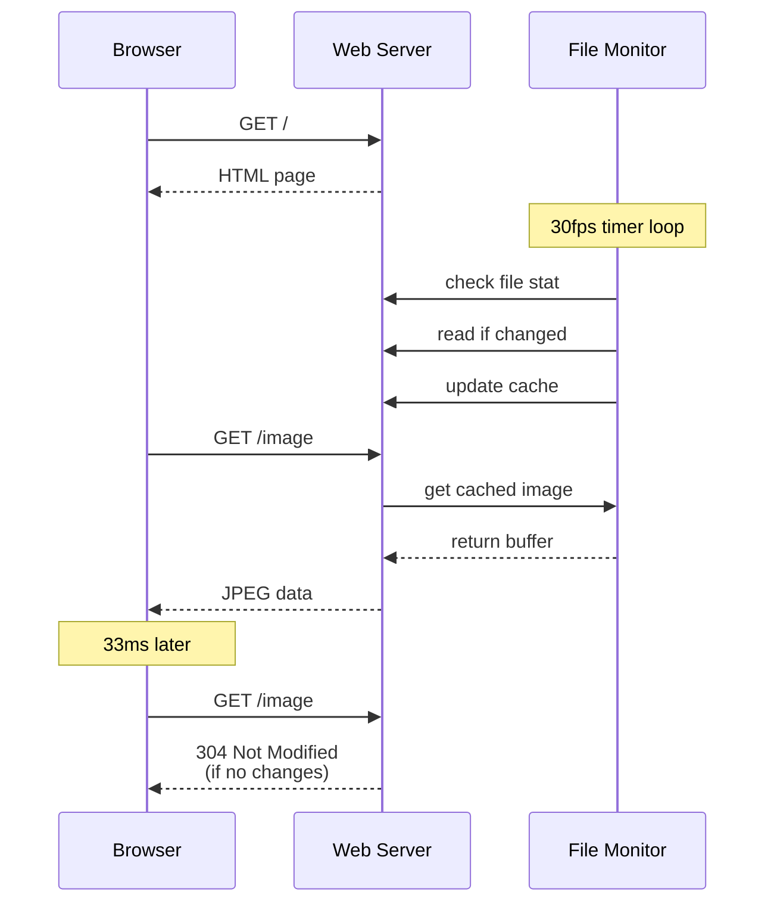

# CLAUDE.md

This file provides guidance to Claude Code (claude.ai/code) when working with the BS Frame Monitor project.

## Project Overview

The **BS Frame Monitor** is an embedded Linux web server written in Go that provides real-time image streaming capabilities. It monitors a local image file and serves it via HTTP at 30 FPS to web browsers.

## Embedded Linux Image Streaming Web Server Implementation Plan

### Requirements Analysis
- **Target**: Embedded Linux device with limited resources
- **Function**: Web server serving real-time image stream from `/tmp/output.jpg`
- **Rate**: 30 FPS image updates
- **Interface**: Static HTML page with live image display
- **Language**: Go for efficiency and single binary deployment

### Architecture Design

```
┌─────────────────────────────────────────────────────────────┐
│                 Embedded Web Server                        │
├─────────────────────────────────────────────────────────────┤
│  HTTP Server (net/http)                                    │
│  ├─ Static file handler (/)                                │
│  ├─ Image endpoint (/image)                                │
│  └─ WebSocket endpoint (/ws) [optional]                    │
├─────────────────────────────────────────────────────────────┤
│  File Monitor                                              │
│  ├─ 30fps timer (33.33ms intervals)                        │
│  ├─ File modification time detection                       │
│  └─ Modification time comparison                           │
├─────────────────────────────────────────────────────────────┤
│  Image Cache                                               │
│  ├─ In-memory JPEG buffer                                  │
│  ├─ Last modification time                                 │
│  └─ File size tracking                                     │
└─────────────────────────────────────────────────────────────┘
                              │
                              ▼
┌─────────────────────────────────────────────────────────────┐
│                    Client Browser                          │
├─────────────────────────────────────────────────────────────┤
│  HTML Page                                                 │
│  ├─  element with auto-refresh                        │
│  ├─ JavaScript timer (33ms)                               │
│  └─ Error handling/fallback                               │
└─────────────────────────────────────────────────────────────┘
```

### Image Polling Strategy

**File Monitoring**:
- `time.Ticker` at 33.33ms intervals (30 FPS)
- `os.Stat()` to check file modification time
- Modification time comparison for change detection
- Graceful handling of missing/locked files

**Optimization**:
- Skip file read if modification time unchanged
- Cache image data in memory buffer
- Use modification time for `ETag` generation
- Conditional GET requests with `If-None-Match`

### Web Interface Design

**HTML Structure**:
```html
<!DOCTYPE html>
<html>
<head>
    <title>BrightSign Frame Monitor</title>
    <meta charset="utf-8">
    <style>
        body { 
            margin: 0; 
            padding: 20px; 
            background: linear-gradient(135deg, #1a1a1a 0%, #2d2d2d 100%); 
            font-family: 'Segoe UI', Tahoma, Geneva, Verdana, sans-serif;
        }
        .header {
            text-align: center;
            margin-bottom: 20px;
            padding: 15px;
            background: rgba(255, 255, 255, 0.1);
            border-radius: 10px;
            backdrop-filter: blur(10px);
        }
        .logo {
            height: 40px;
            margin-bottom: 10px;
        }
        .title {
            color: #fff;
            font-size: 24px;
            font-weight: 300;
            margin: 0;
        }
        .frame-container {
            max-width: 90%;
            margin: 0 auto;
            background: linear-gradient(45deg, #ff6b35, #f7931e);
            padding: 15px;
            border-radius: 15px;
            box-shadow: 0 8px 32px rgba(0, 0, 0, 0.3);
        }
        .inner-frame {
            background: #000;
            padding: 10px;
            border-radius: 8px;
            position: relative;
        }
        #image { 
            width: 100%; 
            height: auto; 
            display: block; 
            border-radius: 5px;
        }
        #status { 
            color: #fff; 
            text-align: center; 
            margin: 10px 0;
            font-size: 14px;
            opacity: 0.8;
        }
        .footer {
            text-align: center;
            margin-top: 20px;
            color: rgba(255, 255, 255, 0.6);
            font-size: 12px;
        }
    </style>
</head>
<body>
    <div class="header">
        <svg class="logo" viewBox="0 0 200 40" xmlns="http://www.w3.org/2000/svg">
            <!-- BrightSign Logo SVG -->
            <text x="10" y="25" fill="#ff6b35" font-family="Arial, sans-serif" font-size="18" font-weight="bold">BrightSign</text>
            <circle cx="180" cy="20" r="8" fill="#f7931e"/>
        </svg>
        <h1 class="title">Frame Monitor</h1>
    </div>
    
    <div class="frame-container">
        <div class="inner-frame">
            <div id="status">Loading...</div>
            
        </div>
    </div>
    
    <div class="footer">
        BrightSign Digital Signage Platform
    </div>
    
    <script>
        // JavaScript for 30fps refresh with cache busting
        setInterval(() => {
            const img = document.getElementById('image');
            img.src = '/image?' + Date.now();
        }, 33);
    </script>
</body>
</html>
```

**Alternative Approaches**:
1. **Cache-friendly**: Use `ETag` headers, check for 304 responses
2. **WebSocket**: Real-time push updates when image changes
3. **Server-Sent Events**: One-way push notifications

### Embedded System Optimizations

**Memory Management**:
- Reuse byte buffers to minimize garbage collection
- Set `GOGC` environment variable for GC tuning
- Use `sync.Pool` for buffer recycling
- Limit concurrent connections with middleware

**CPU Efficiency**:
- Only read file when modification time changes
- Use `io.Copy` for efficient file operations
- Implement connection pooling/keep-alive
- Graceful degradation under load

**Network Optimization**:
- Gzip compression for HTML (not images)
- Proper HTTP cache headers
- Connection timeout settings
- Rate limiting for protection

## Complete Implementation Plan

### Project Structure
```
image-stream-server/
├── main.go                 # Application entry point
├── internal/
│   ├── server/
│   │   ├── server.go       # HTTP server setup
│   │   └── handlers.go     # Route handlers
│   ├── monitor/
│   │   └── file_monitor.go # File monitoring logic
│   └── cache/
│       └── image_cache.go  # Image caching system
├── web/
│   └── index.html          # Static HTML page
├── go.mod
├── go.sum
└── README.md
```

### Core Components

1. **Main Application** (`main.go`)
   - CLI argument parsing (port, file path, refresh rate)
   - Graceful shutdown handling
   - Signal handling (SIGINT, SIGTERM)

2. **HTTP Server** (`internal/server/`)
   - Route setup: `/` (HTML), `/image` (JPEG), `/health`
   - Middleware: logging, compression, rate limiting
   - Error handling and recovery

3. **File Monitor** (`internal/monitor/`)
   - 30fps ticker with file stat checking
   - Modification time-based change detection
   - Graceful error handling for missing files

4. **Image Cache** (`internal/cache/`)
   - Thread-safe image buffer storage
   - Modification time-based ETag generation
   - Memory-efficient buffer management

### Key Dependencies
- Standard library only (no external dependencies)
- Optional: `golang.org/x/time/rate` for rate limiting

### Deployment
- Single static binary
- Systemd service configuration
- Docker container option
- Cross-compilation for ARM/x86

### Sequence Diagram



## Development Commands

### Build and Run
```bash
# Build the server
make build

# Run with default settings
make run

# Run with debug logging
make run-debug

# Run with custom settings (port 8080, custom file path)
make run-custom

# Build for all embedded platforms
make build-embedded

# Build for specific platform
make build-linux   # Linux x86_64
make build-arm     # ARM 32-bit
make build-arm64   # ARM 64-bit
make player        # Rockchip ARM64 player
```

### Testing
```bash
# Run unit tests
make test

# Run with coverage
make test-coverage

# Load testing
make load-test

# Run full development cycle (format, vet, test, build)
make dev-cycle

# Format code
make fmt

# Vet code
make vet

# Lint code (requires golangci-lint)
make lint
```

### Cross-compilation for Embedded Targets
```bash
# Build for all embedded platforms at once
make build-embedded

# Individual platform builds:
# For ARM64 (Raspberry Pi 4, etc.)
make build-arm64

# For ARM (Raspberry Pi 3, etc.)
make build-arm

# For x86_64 Linux
make build-linux

# For Rockchip ARM64 player
make player

# Clean all build artifacts
make clean
```

The design provides efficient 30fps image streaming with minimal resource usage, perfect for embedded Linux environments.